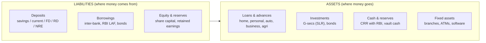
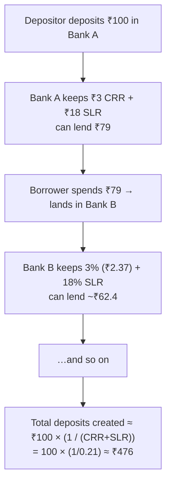
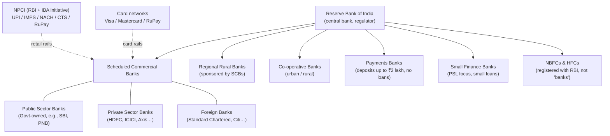

# 10. Banking Fundamentals — How Banks Work

> **Research domain doc** · V1 Banking Core · All figures as of **August 2026** unless noted.
> This is the first of the *domain knowledge* series (`10`–`19`). It explains what a bank
> actually is, where its money comes from, and how it creates credit.

---

## 1. What is a bank?

A bank is a financial intermediary that:

1. **Collects deposits** from savers (households, firms, government) — these are its **liabilities**.
2. **Lends** those funds to borrowers — these are its **assets**.
3. **Makes money on the spread** between the interest it pays on deposits and the interest it
   earns on loans, plus fees (ATM interchange, service charges, forex, cards, etc.).

A bank does **not** need a physical vault of cash equal to its deposits. It operates on the
principle of **fractional reserve banking**: only a small fraction of deposits is held as
reserves; the rest is lent out, which creates new deposits elsewhere — the **credit creation
multiplier**.

---

## 2. The bank balance sheet

| Side | Examples | Notes |
|---|---|---|
| **Liabilities** | Savings/current accounts, FDs, RDs, NRE/NRO, borrowings | Deposits are ~80% of bank funding in India |
| **Assets** | Home/auto/personal/MSME/agri loans, G-sec investments, CRR cash | Loans are ~60–65% of total assets |
| **Equity** | Share capital + reserves | Basel III requires CAR ≥ 11.5% (9% + 2.5% CCB) |

---

## 3. Fractional reserves & credit creation

If the **Cash Reserve Ratio (CRR)** is `r` (currently **3.0%**, phased in from Nov 2025) and the
**Statutory Liquidity Ratio (SLR)** is **18%**, a bank must keep `r` of deposits as cash with RBI
and 18% in G-secs. The rest (~79%) can be lent.

The **credit multiplier** = `1 / (CRR + SLR + other reserve drains)`. This is why CRR/SLR changes
are a powerful policy lever: lowering CRR from 4% to 3% expands lending capacity by billions.

> **Mapped in code:** this repo simulates the *retail* side of this — `banking_core.services.ATMService`
> enforces per-user limits/fees; `banking_core.models.credit_scorer` decides who gets loans, while
> `banking_core.models.savings_optimizer` & `loan_default_model` model the asset side.

---

## 4. The Indian banking structure

| Category | Count (approx) | Characteristics |
|---|---|---|
| Public sector banks | 12 | Majority Govt ownership; financial inclusion mandate |
| Private sector banks | ~21 | Profit-driven; strong tech adoption |
| Foreign banks | ~45 | Branch licensing by RBI; NOF requirements |
| Regional rural banks | ~43 | Agri/rural focus, sponsored by an SCB |
| Small finance banks | 12 | Minimum loan ticket ≤ ₹25 lakh; PSL ≥ 75% of ANBC |
| Payments banks | 6 | Deposit ≤ ₹2 lakh, no credit/loans |
| Co-operative banks | ~1,400+ | Regulated by RBI + RCS |

---

## 5. Where bank profits come from

1. **Net interest income (NII)** — the spread between lending and deposit rates (the biggest chunk).
2. **Fee income** — ATM interchange, transaction charges, locker, forex, demat, card fees.
3. **Trading & treasury** — G-sec gains, forex, derivatives.
4. **Recovery** — from written-off loans and sales of stressed assets.

Costs: interest on deposits, operating costs (branches, ATMs, staff, tech), **loan loss
provisions** (the largest risk item — banks must provision for bad loans per RBI norms).

---

## 6. Key regulator levers RBI uses

| Lever | Current value (Aug 2026) | Effect |
|---|---|---|
| Repo rate | **5.25%** | Cost of bank borrowing from RBI → pushes loan rates |
| SDF / MSF | 5.00% / 5.50% | Floor & ceiling of the LAF corridor |
| CRR | **3.0%** | Share of deposits held as cash with RBI → limits credit creation |
| SLR | **18%** | Share of deposits held in G-secs → liquidity safety |
| Bank rate | 5.50% | Penalty-rate benchmark (now aligned with MSF) |

---

## 7. Sources for further research

- RBI Act 1934 & Banking Regulation Act 1949 — legal foundation
- RBI Master Directions (CRR/SLR Directions 2025, updated Jun 2026)
- RBI Weekly Statistical Supplement (repo/CRR/SLR table)
- Monetary Policy Statement Aug 5, 2026 (62nd MPC meeting — repo held at 5.25%, neutral stance)

**Next doc:** [`11-atm-operations.md`](11-atm-operations.md) — how ATMs work end to end.
