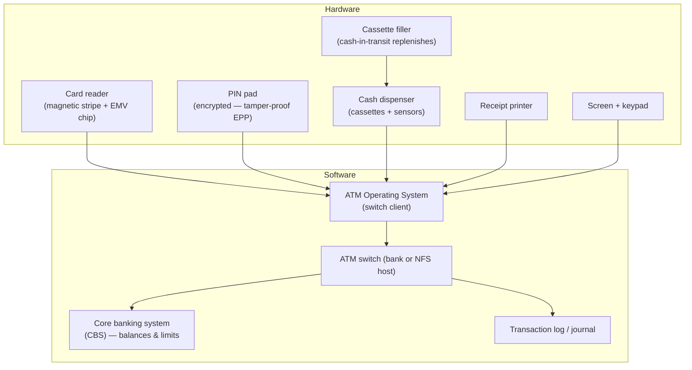
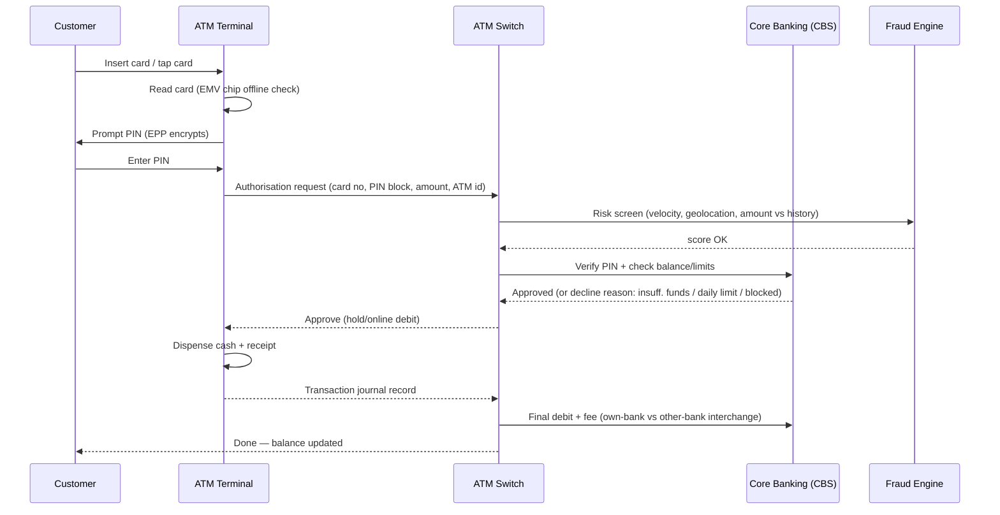
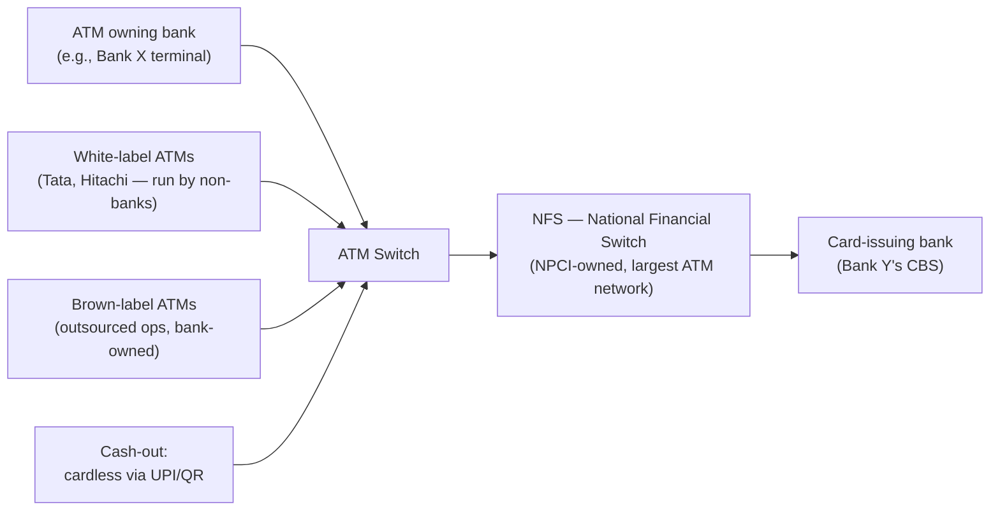

# 11. ATM Operations — How an ATM Works

> **Research domain doc** · V1 Banking Core · Real RBI ATM/card statistics analysed in
> [`19-real-data-validation.md`](19-real-data-validation.md).

---

## 1. Anatomy of an ATM

ATM = **Automated Teller Machine**. The user-facing terminal is a thin client; the real decisions
(balance, limits, fraud scoring) happen in the bank's **ATM switch** and **core banking system**.

---

## 2. The withdrawal workflow (what happens in seconds)

### Step-by-step detail

1. **Card authentication** — EMV chip does an offline risk check; PIN entered is encrypted on the
   tamper-proof **EPP (Encrypted PIN Pad)** and never stored in clear.
2. **Authorisation** — the switch sends an ISO 8583 message (the global ATM/card protocol) to the
   card-issuing bank's CBS.
3. **Rules engine** — this repo models the classic retail rules in
   `banking_core.services.ATMService` and `banking_core/domain/account.py`:
   - balance >= amount + fee
   - daily withdrawal limit (ATM switch level)
   - minor accounts: lower caps per RBI
   - card active & PIN correct
4. **Dispense** — cash cassettes are counted by sensors; a dispense failure triggers auto-reversal
   of the debit.
5. **Settlement** — the transaction is settled between the ATM-owning bank and the card-issuing
   bank through the **ATM network (NFS)** and final settlement in RBI accounts (see doc 13).

---

## 3. ATM networks in India

- **NFS** connects ~all Indian banks — a card from Bank Y works on Bank X's ATM via NFS.
- **Interchange fee**: when a customer uses another bank's ATM, the issuing bank pays the ATM
  owner bank an interchange (free for customer up to 3+3/month limits since Jan 2022; fees beyond).
- **White-label**: non-bank companies run ATMs with their own brand (Tata Indicash, Hitachi Money Spot).
- **Cash management**: banks forecast demand (models like this repo's `cash_demand_forecaster` /
  `atm_replenishment`) to minimise cost of cash + re-fill trips.

---

## 4. Fee & limit structures (retail norms in India)

| Item | Typical norm |
|---|---|
| Own-bank ATM withdrawals | Free |
| Other-bank ATM (metro) | Free up to 3/month, then ₹20+ |
| Other-bank ATM (non-metro) | Free up to 5/month, then ₹20+ |
| RBI minor-account limits | Tighter daily caps, guardian co-signing |
| Daily cash withdrawal cap | Bank-set (e.g., ₹50k–₹2L/day) |

> **Mapped in code:** `banking_core.services.ATMService` enforces `can_withdraw`, fees,
> daily limits; `banking_core/models/real_time_fraud_detector.py` scores each ATM txn;
> `cash_demand_forecaster.py` & `atm_replenishment.py` model cash logistics.

---

## 5. Real-world scale (validation data)

The repo ships real RBI data — `v1_banking_core/data/raw/RBI_ATM_Card_Statistics.csv`
(65 banks × 10 monthly snapshots). Headline numbers computed from it (see doc 19):

| Metric (across reported months) | Value |
|---|---|
| Banks reported | 65 |
| On-site + off-site ATMs (total reported) | ~2.09 million |
| Debit cards outstanding (total reported) | ~10.19 billion |
| Credit cards outstanding (total reported) | ~1.13 billion |
| UPI QR codes (total reported) | ~7.02 billion |

---

## 6. Failure modes & safeguards

- **Dispense failure** → auto-reversal / exception queue at the switch.
- **Card trapping / skimming** → anti-skimming devices, EMV chips, tamper alarms (doc 17).
- **Network outage** → offline fallback with amount limits, or degrade to decline.
- **Cash-out** → cassette empty before batch settlement triggers replenishment alert.

**Next doc:** [`12-transaction-lifecycle.md`](12-transaction-lifecycle.md) — payment systems and clearing.
