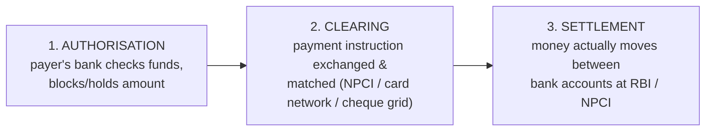
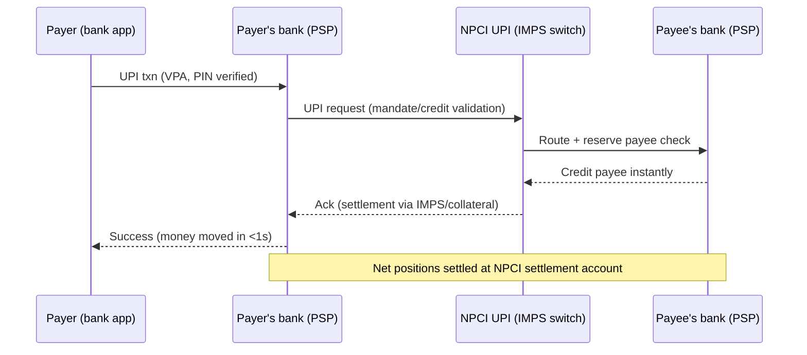
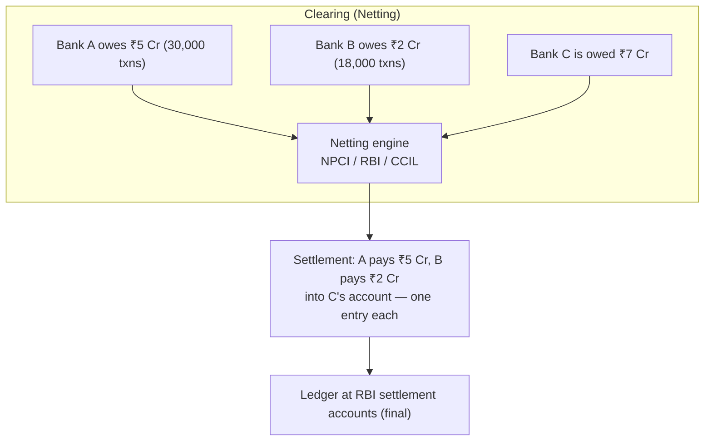
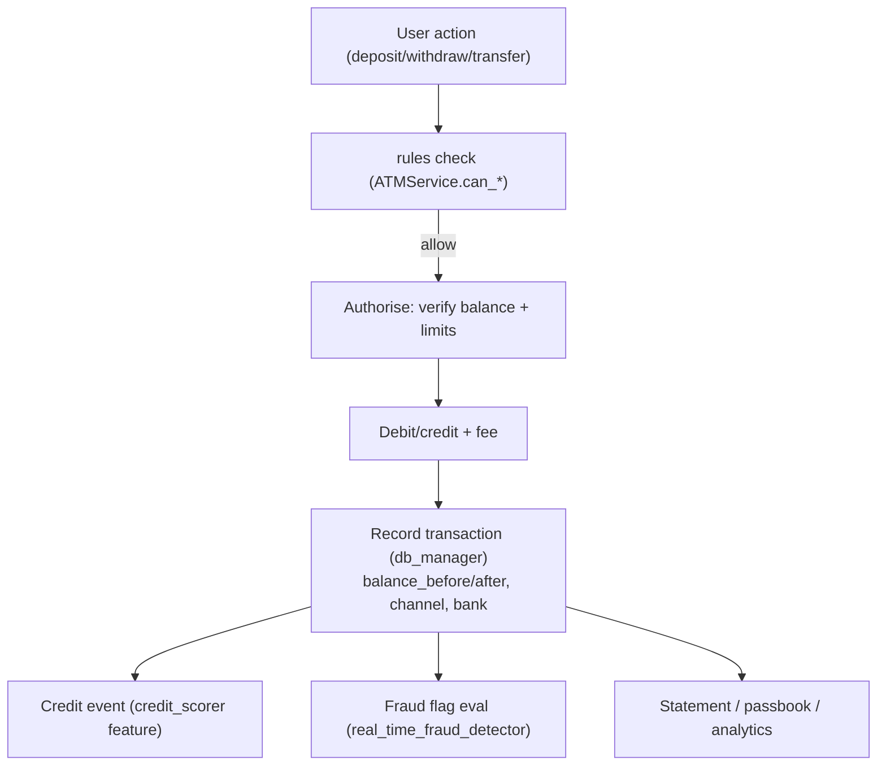

# 12. Transaction Lifecycle — Payment Systems, Clearing & Settlement

> **Research domain doc** · V1 Banking Core · Covers NEFT, RTGS, IMPS, UPI, cards, and the
> clearing/settlement machinery behind every transaction.

---

## 1. The three phases of every payment

| Phase | What happens | Example time |
|---|---|---|
| **Authorisation** | Verify funds, limits, fraud rules; place hold | ms–seconds |
| **Clearing** | Netting of obligations, instruction exchange | seconds–hours |
| **Settlement** | Final transfer of funds between banks' settlement accounts | seconds–T+1 |

> **Mapped in code:** the repo simulates authorisation + internal settlement
> (`ATMService.record_transaction` with `balance_before/after`), while
> `banking_core.data.db_manager` persists the ledger. Inter-bank settlement (below) is the
> real-world analogue the simulator abstracts.

---

## 2. India's payment rails

| System | Runs on | Speed | Limit | Typical use |
|---|---|---|---|---|
| **UPI** | NPCI | Real-time (24×7) | ~₹1–5L per txn (bank-set) | Retail, P2P, P2M |
| **IMPS** | NPCI | Real-time (24×7) | ₹5L | Transfers, bill pay |
| **NEFT** | RBI | Batched, 24×7 (half-hourly batches) | No cap | Bulk retail transfers |
| **RTGS** | RBI | Real-time gross settlement, 24×7 | ₹2L+ | Large/high-value |
| **Cards** | Visa/MC/RuPay networks | Real-time auth, batch settlement | Credit limit / per-card | PoS, e-commerce |
| **Cheque (CTS)** | NPCI grid | Paper clearing, T+0/T+1 | No cap | Formal business payments |
| **NACH** | NPCI | Batch (3 cycles/day) | No cap | Salary, dividends, EMIs |

### UPI flow (the world's busiest real-time rail)

**Real scale (NPCI, June 2026):** 22.72 billion UPI transactions worth ₹28.9 lakh crore —
~757 million transactions per day. May 2026 held the record: 23.2 billion / ₹29.9 lakh crore.
UPI is now live in 8+ countries (UAE, Singapore, Nepal, France, Mauritius, Qatar…).

---

## 3. Clearing vs settlement — the money actually moves later

When you pay someone at another bank:

1. Your bank debits you **instantly** (authorisation).
2. At the next clearing cycle, the network computes **net positions** (who owes whom).
3. Settlement happens **once**, net, through the settlement account at RBI/NPCI — not per
   transaction. This "netting" collapses millions of transactions into a few account entries.

**Settlement risk** is why central banks exist: if Bank A fails *between* clearing and settlement,
everyone is exposed. RTGS removes this for large payments (gross, real-time, final).

---

## 4. Where each rail settles

| Rail | Clearing operator | Settlement |
|---|---|---|
| UPI / IMPS / NACH / CTS / RuPay | NPCI | NPCI settlement account (banks fund in advance) |
| NEFT / RTGS | RBI | Banks' current accounts at RBI (final & irrevocable) |
| Visa / Mastercard | Card networks | Networks settle via nostro accounts / CCIL |
| Cheque | NPCI CTS grid | At the payee bank's clearing cell |

---

## 5. Transaction lifecycle in THIS codebase (simulation)

Every transaction row in `ecosystem.db` mirrors the real-world fields: `txn_type, amount, fee,
channel, target_account, target_bank, balance_before, balance_after, timestamp` — the same
information an ATM switch journal keeps.

**Next doc:** [`13-interbank-relationships.md`](13-interbank-relationships.md) — how banks interact with each other.
