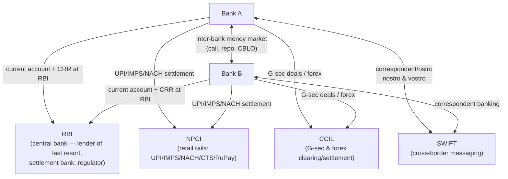
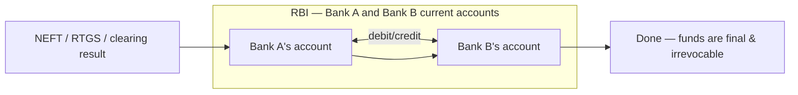
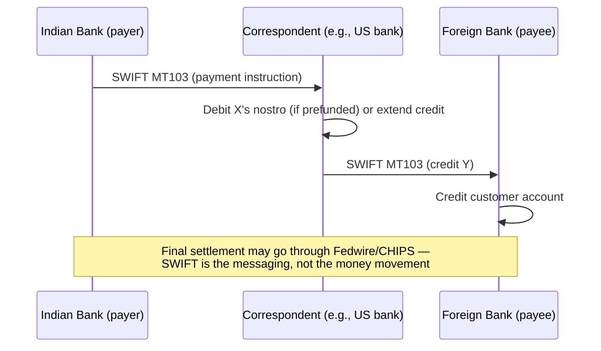
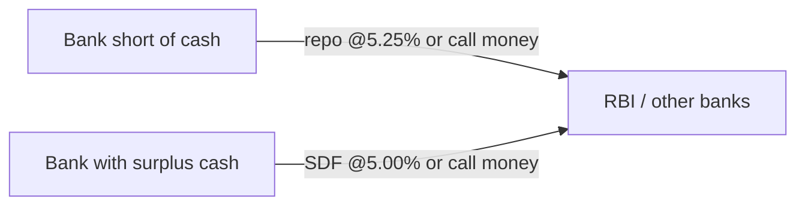

# 13. Inter-bank Relationships — How Banks Interact

> **Research domain doc** · V1 Banking Core · Who owes whom, who settles, and how money actually
> moves between banks — through RBI, NPCI, CCIL, correspondent banks, and the money market.

---

## 1. The ecosystem map

---

## 2. The settlement layer: every bank has an account at RBI

The **current account each bank holds at RBI** is the ultimate settlement ledger. When Bank A
must pay Bank B (any rail), the final step is always an entry between these two RBI accounts.

- **CRR** is held within this same RBI relationship (3% of NDTL since Nov 2025).
- **SLR** (18%) is a separate portfolio of G-secs the bank owns (liquidity buffer).
- If a bank is short at end of day → it borrows: repo from RBI (5.25%) or from other banks.

---

## 3. Correspondent banking — nostro & vostro

For **cross-border** payments, banks rarely have direct accounts in every country. They use
**correspondent banks**:

| Account | Whose perspective | Meaning |
|---|---|---|
| **Nostro** ("ours") | Bank A's view | "Our account held at Bank B (abroad)" |
| **Vostro** ("yours") | Bank B's view | "Your account held at us" |
| **Loro** ("theirs") | Third bank's view | Account held by a third party for another |

India's **Rupee Vostro mechanism** (2022–23, after RBI's internationalisation push) lets partner
country banks hold vostro accounts in India and settle trade in INR directly — bypassing USD
correspondent chains.

---

## 4. Retail rails settlement — NPCI

- NPCI runs a **settlement account** structure: banks pre-fund the account; net obligations are
  settled multiple times daily.
- RuPay (card network) also settles through NPCI.
- UPI settlement happens near-continuously (multiple batches) → low counterparty risk.

---

## 5. The inter-bank money market

Banks manage daily liquidity with each other (and with RBI):

| Instrument | What it is | Current anchor |
|---|---|---|
| **Call money** | Unsecured overnight borrowing between banks | Market-driven |
| **Repo (Liquidity Adjustment Facility)** | Banks borrow from RBI against G-secs | **5.25%** |
| **SDF** | Banks park surplus cash with RBI | **5.00%** |
| **MSF** | Emergency borrowing from RBI (up to SLR %) | **5.50%** |
| **CBLO** | Collateralised borrowing-lending on CCIL platform | Market-driven |
| **Inter-bank FD/placements** | Term deposits between banks | Market-driven |

The repo rate therefore becomes the **floor cost of money** for every bank — which is why loan
rates (MCLR/EBLR) track it (see doc 16).

---

## 6. What this means for the simulation

The repo's simulator is **single-bank** (`ATMService` handles one account ledger), but it models
the concepts:

- `banking_core.bank_attributes.get_bank_attrs()` — bank-specific fee/limit structures
  (e.g., other-bank ATM fees) = the interchange/institution layer.
- `target_bank` fields in transactions = the *other* bank in a transfer.
- `bank_clustering` / `market_share` analytics = how banks compare in the ecosystem (real RBI CSV).

**Next doc:** [`14-loans-and-credit.md`](14-loans-and-credit.md) — loan types, eligibility and RBI norms.
