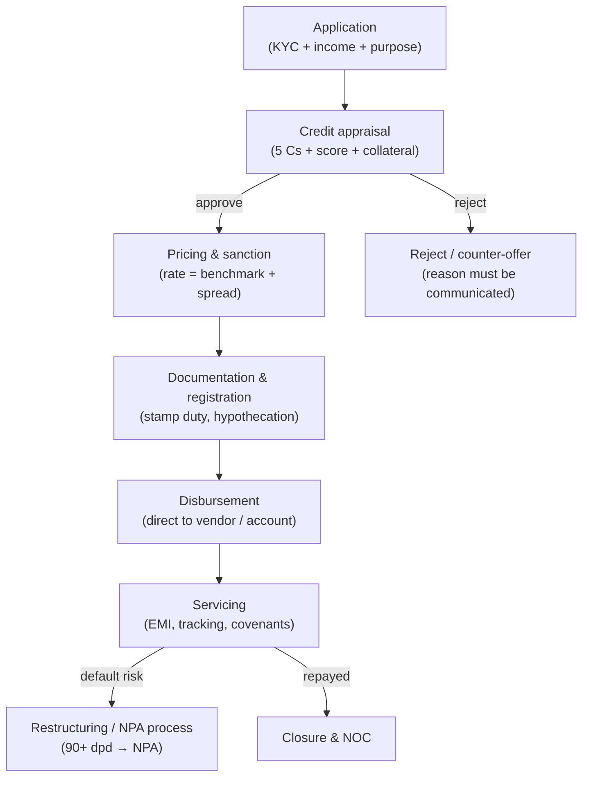
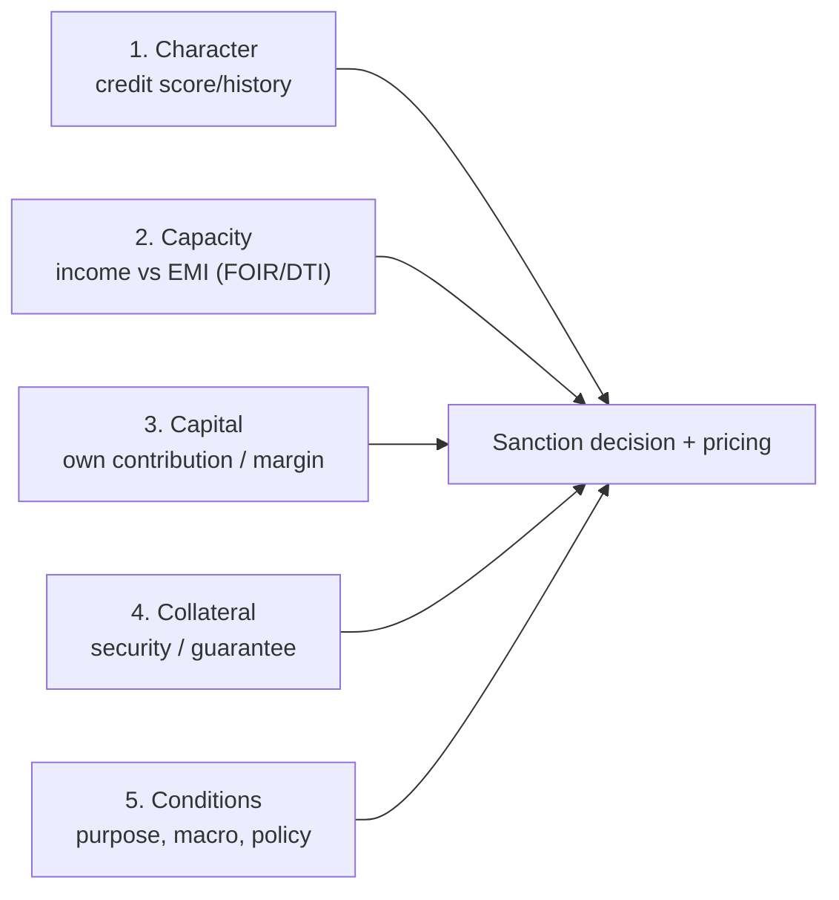
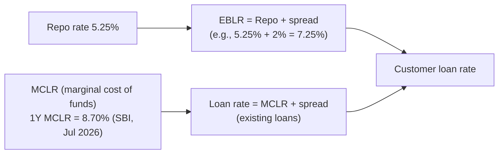

# 14. Loans & Credit — Types, Eligibility, RBI Norms, Documents

> **Research domain doc** · V1 Banking Core · Rates as of **Aug 2026** (SBI published rates;
> RBI MPC Aug 5, 2026).

---

## 1. The loan lifecycle

---

## 2. Loan categories (retail focus)

| Loan | Typical rate (Aug 2026, SBI) | Tenure | Secured? |
|---|---|---|---|
| **Home loan** | 7.25% p.a. onwards | up to 30 yrs | Yes (property mortgage) |
| **Personal loan** | 10.00–15.00% (2-yr MCLR 8.75% + spread 1.25–6.25%) | 1–6 yrs | No |
| **Auto loan** | ~8.7% p.a. onwards | up to 7 yrs | Yes (vehicle hypothecation) |
| **Education loan** | ~8.7% p.a. | course + margin period | Collateral > ₹7.5L (for studies abroad) |
| **Gold loan** | ~9.15% p.a. onwards | 1–3 yrs | Yes (gold pledge, LTV ≤ 75%) |
| **Credit card revolving** | 3.5–4% / month equivalent | revolving | No |
| **MSME/ business** | Benchmark + spread | 1–15 yrs | Mixed (CME/CGTMSE cover) |

---

## 3. The 5 Cs of credit appraisal

### Typical eligibility matrix (retail)

| Parameter | Home loan | Personal loan | Auto loan |
|---|---|---|---|
| Min CIBIL score | ~650+ | ~700+ | ~650+ |
| Min age | 21 | 21 | 21 |
| Max age at maturity | 65–70 (salaried) | 58–60 | 65 |
| FOIR / DTI limit | ~50–55% of net income | ~50% | ~50% |
| Max LTV | 75–90% (see table) | — | 80–90% |

### RBI home-loan LTV norms (per loan amount)

| Loan amount | Max LTV (up to ₹30L) | Max LTV (₹30L–₹75L) | Max LTV (> ₹75L) |
|---|---|---|---|
| Standard | 90% | 80% | 75% |

---

## 4. How loan interest is priced (2019+ framework)

Since Oct 2019, **all new retail & MSME loans must be linked to an external benchmark**
(EBLR — repo-linked, e.g., **Repo + spread**) — or MCLR (existing loans):

**MCLR components** (RBI methodology): marginal cost of funds (repo/borrowings + deposits) +
operating cost + CRR cost. RBI announced (Aug 2026) **revised loan pricing norms** to address
divergent practices — watch for updates.

---

## 5. RBI norms every lender must follow

- **Priority Sector Lending (PSL):** SCBs must lend **40%** of ANBC to priority sectors
  (agri, MSME, education, housing up to limits, social infra). SFBs: 75%.
- **No pre-payment penalty** on floating-rate home loans to individuals.
- **Repricing frequency:** banks must offer reset at least once every 3 months for EBLR loans.
- **NPA classification:** 90+ days overdue → NPA → provisioning (15%+ depending on age).
- **Risk weights & capital:** retail loans have standardised risk weights (Basel III, doc 15).
- **Interest-on-interest waiver** during Covid-19 was a landmark RBI intervention (2020) —
  now codified in circulars for borrower relief during disasters.

---

## 6. Document checklist (typical retail)

| Purpose | Documents |
|---|---|
| **KYC (all loans)** | Aadhaar/PAN + address proof (OVD list — doc 15) |
| **Income proof** | Salary slips (3–6 mo), bank statement (6 mo), ITR + Form 16 (self-employed) |
| **Property/asset** | Title deed, sale deed, agreement, approved plan, valuation report |
| **Vehicle** | Invoice, registration, insurance |
| **Education** | Admission letter, fee structure, course duration |
| **Gold** | Coins/jewellery with purchase bills or source declaration |

---

## 7. Mapped in code

- `banking_core.models.credit_scorer` — score-based eligibility (doc 18)
- `banking_core.models.loan_default_model` — PD modelling for pricing/limits
- `banking_core.models.savings_optimizer` — FD/RD/loan payoff trade-offs
- `banking_core.domain.account` + `ATMService.can_transfer` — balance/collateral-like rules
- `banking_core.ecosystem` DB tables (`credit_events`, `loans`) — the ledger

**Next doc:** [`15-kyc-aml-regulations.md`](15-kyc-aml-regulations.md) — KYC, AML and Basel.
