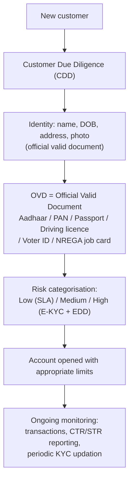
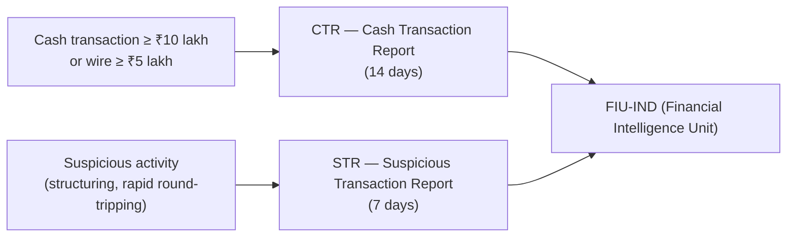
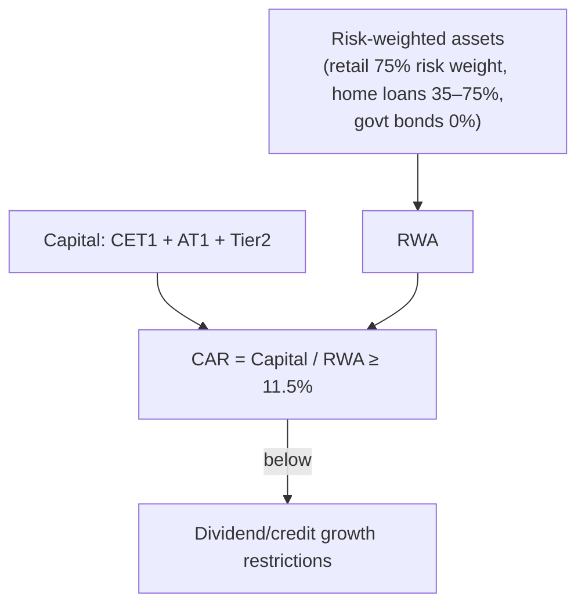

# 15. KYC, AML & Basel — The Regulatory Layer

> **Research domain doc** · V1 Banking Core · RBI KYC Master Direction 2016 (as amended),
> PMLA 2002, Basel III.

---

## 1. Why KYC exists

KYC (Know Your Customer) is the legal duty of every bank to **identify the customer and
understand their transactions** — it is the front line against money laundering, terror
financing, fraud, and benami (hidden) accounts. Framework: RBI KYC Master Direction 2016 +
PMLA (Prevention of Money Laundering Act) 2002 rules.

### Three KYC tiers

| Tier | Documents | Accounts affected |
|---|---|---|
| **Simplified (SLA)** | Any OVD | Low-risk: small savings, PMJDY |
| **Normal** | OVD + verified identity | Standard accounts |
| **Enhanced (EDD)** | Source of funds/wealth, references | Politically exposed persons (PEPs), high-risk |

---

## 2. AML reporting — when the bank must tell the regulator

| Report | Trigger (typical) | Deadline |
|---|---|---|
| CTR | Cash transactions ≥ ₹10 lakh in a day | 14 days |
| STR | Any suspicious activity (no threshold) | 7 days |
| Cross-border wire | ≥ ₹5 lakh | 14 days |
| Counterfeit currency notes | ₹10,000+ | 24 hours (also RBI) |

**PMLA** also requires: record-keeping (5 years), KYC updates (every 2/10 years per risk), and
appointment of a Principal Officer + Designated Director for compliance.

---

## 3. Basel III — capital & liquidity safety nets

The Basel Accords (BIS) set international standards India adopts:

| Metric | Requirement | Purpose |
|---|---|---|
| **Minimum capital (CAR)** | 9% of risk-weighted assets | Loss absorption |
| **Capital conservation buffer (CCB)** | 2.5% | Cushion in stress |
| **Total requirement** | **11.5%** (CET1 ≥ 7%) | Combined floor |
| **Leverage ratio** | ≥ 4% | Limit leverage |
| **LCR** | ≥ 100% (HQLA vs 30-day outflow) | Short-term liquidity |
| **NSFR** | ≥ 100% | Structural liquidity |
| **DICGC deposit insurance** | **₹5 lakh per depositor per bank** | Retail protection (raised 2020) |

---

## 4. Mapped in code

This repo implements the **retail KYC rules** faithfully in
`banking_core.services.user_service`:

- Minor accounts → **guardian KYC** (name/address match checks, RBI-style)
- `income_bracket` + `income_status` categorisation (risk tiering)
- PIN hashing (`hash_pin`), session logging, `record_fraud_flag`
- `ecosystem.db` tables mirror KYC fields (age, income status, guardian, bank)

**Next doc:** [`16-interest-rates.md`](16-interest-rates.md) — how rates flow from RBI to customers.
