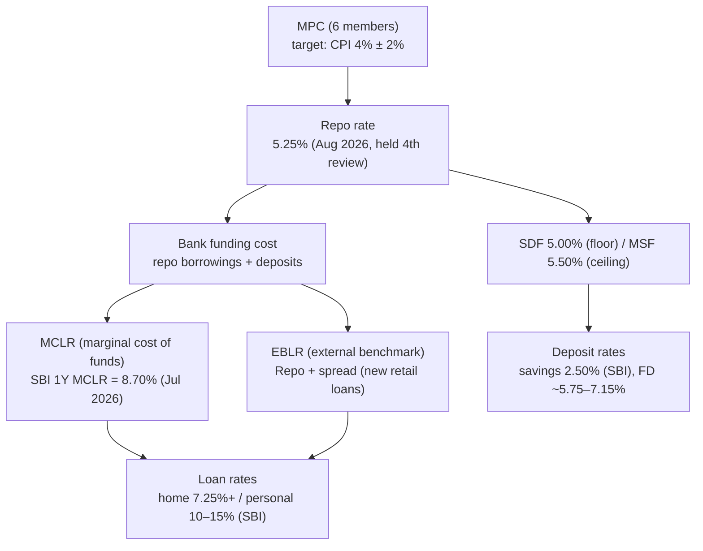
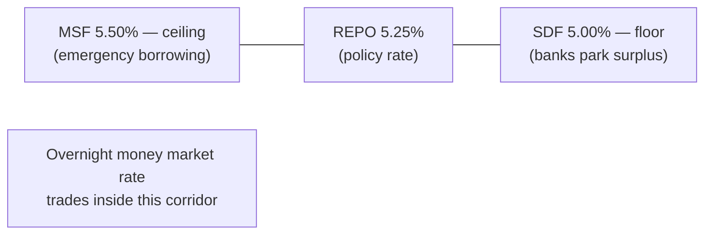

# 16. Interest Rates — From the Repo Rate to Your Savings Account

> **Research domain doc** · V1 Banking Core · Rates as of **Aug 2026** (RBI MPC Aug 5, 2026;
> SBI published rates).

---

## 1. The transmission chain

**Transmission lag:** RBI changes the repo rate → banks reprice within weeks to months
(deposits lag loans — "sticky" deposit rates). The full pass-through is measured by RBI's
**transmission index**.

---

## 2. The LAF corridor (how RBI steers overnight money)

| Rate | Level (Aug 2026) | Who uses it |
|---|---|---|
| SDF (Standing Deposit Facility) | 5.00% | Banks parking excess cash |
| Repo (LAF) | **5.25%** | Banks borrowing against G-secs |
| MSF (Marginal Standing Facility) | 5.50% | Emergency borrowing (up to SLR stock) |
| Bank rate | 5.50% | Penalty benchmark (aligned with MSF) |
| CRR | 3.0% | Reserve on deposits (Nov 2025 phase-in) |
| SLR | 18% | G-sec holding requirement |

---

## 3. MCLR — how it's computed

RBI's MCLR methodology (Apr 2016):

1. **Marginal cost of funds** = repo-linked borrowings + deposit costs (weighted)
2. **+ Operating costs**
3. **+ Cost of CRR** (3% of NDTL earns no interest)
4. **= MCLR** (tenor-wise: overnight → 3 years)

SBI MCLR (effective **15 Jul 2026**): overnight/1M 7.85%, 3M 8.25%, 6M 8.60%, **1Y 8.70%**,
2Y 8.75%, 3Y 8.80%. Personal loans are priced as *2Y MCLR + spread* (10.00–15.00%).

---

## 4. EBLR — the 2019 rule change

Since **Oct 1, 2019**, all new floating retail/MSME loans must link to an external benchmark
(typically repo): **loan rate = Repo + spread**. Benefits: faster transmission, transparency
(repricing at least once per quarter).

| Feature | MCLR (legacy) | EBLR (new) |
|---|---|---|
| Benchmark | Bank's own cost of funds | Repo / T-bill / 1Y G-sec |
| Transmission speed | Slow (banks set tenor-wise) | Immediate (repo moves → rate moves) |
| Repricing | At reset dates | ≥ quarterly, transparent |
| Penalty | Prepayment penalty banned on floating home loans | Same |

---

## 5. Deposit rates (why they lag)

| Instrument | SBI rate (2026) | Notes |
|---|---|---|
| Savings account | 2.50% p.a. | On daily balance |
| FD (retail) | ~5.75% (up to ₹2L) – ~7.15% (long tenor/bulk bands) | Senior citizens +0.50% |
| RD | ~6–7% p.a. | Monthly deposits |

Banks keep deposit rates sticky because: depositors are rate-inert, and re-pricing deposits
instantly would compress NIM (net interest margin). This is the "stickiness" that monetary
transmission models study.

---

## 6. Why it matters for this repo

- `banking_core.models.savings_optimizer` — FD vs RD vs loan pre-payment decisions at a given rate
- `banking_core.models.spending_forecaster` / `trend_analyzer` — consumption responds to rates
- `banking_core.models.credit_scorer` — affordability (FOIR) depends on EMI at current rate
- Loan defaults rise when repo tightens → `loan_default_model` scenario sensitivity

**Next doc:** [`17-fraud-and-security.md`](17-fraud-and-security.md) — fraud taxonomy and detection.
