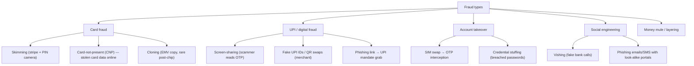
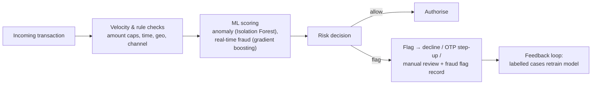

# 17. Fraud & Security — Taxonomy, Detection, RBI Liability Rules

> **Research domain doc** · V1 Banking Core · Maps real-world fraud to the repo's
> `real_time_fraud_detector`, `anomaly_detector` and `user_service.record_fraud_flag`.

---

## 1. Fraud taxonomy (what actually happens in the wild)

---

## 2. Detection stack (rule-based + ML)

| Defence | Mechanism | Where (repo) |
|---|---|---|
| EMV chip + tokenisation | Card data never sent to merchants | — |
| 3-D Secure (SCA) | OTP step-up for CNP | web `/security` |
| Velocity checks | Limits on txns/time-window | `ATMService.can_*` |
| Anomaly detection | Isolation Forest on txn features | `models/anomaly_detector` |
| Real-time scoring | Boosted tree on stream features | `models/real_time_fraud_detector` |
| Device/intent analysis | New-device + new-amount triggers | `user_service.record_fraud_flag` |

---

## 3. RBI customer liability rules (who pays when you're defrauded)

Under the RBI "Limited Liability" framework (Dec 2017 circular), if the **bank is at fault**
(system failure, SIM swap not handled, phishing on bank's own platform) → **zero liability** for
the customer. If customer was negligent (shared OTP) → liability is capped **up to ₹10,000**
(within 7 days of reporting), ₹15,000 (8–90 days), and zero only if reported within 3 days and
the bank's system was breached — precise limits differ per scenario; **always report within 3
days**.

| Report timing | Liability |
|---|---|
| Within 3 days of unauthorised txn | Zero liability (customer must not be negligent) |
| 4–7 days | Zero liability if bank system fault; else capped (₹10k/₹15k) |
| Beyond 7 days (but < 90) | Customer bears loss if bank not at fault |

---

## 4. Operational security

- **PCI-DSS** for card data environments (PAN encryption, tokenisation).
- **PCI-PIN** — tamper-evident EPPs, no PIN in logs (this repo: PINs stored only as salted hashes).
- **ISO 8583** host security — MAC on messages, session keys.
- **Regulatory reporting:** fraud must be reported to RBI (Sachet portal / RBI‑Integrated Ombudsman
  Scheme 2021 — single window for complaints: `rbi.org.in`).

---

## 5. This repo's fraud pipeline

`ATMService` → `record_transaction` → `record_fraud_flag(user_id, amount, fraud_score, reasons)`
persists flagged events; `real_time_fraud_detector` scores each txn; `anomaly_detector` finds
unusual patterns in history. The web `/security` page explains these controls to users —
mirroring what a real bank's app shows.

**Next doc:** [`18-credit-scoring.md`](18-credit-scoring.md) — how credit scores are built.
