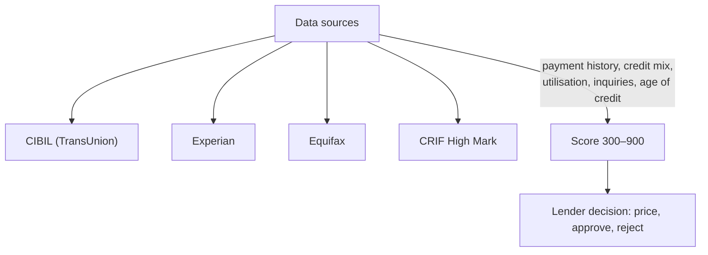
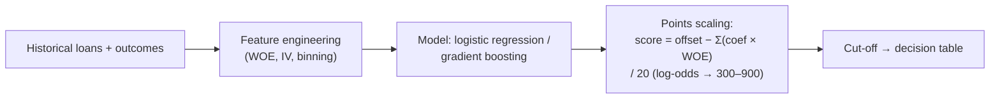

# 18. Credit Scoring — How a CIBIL Score Is Built

> **Research domain doc** · V1 Banking Core · Maps bureau scoring to the repo's
> `models/credit_scorer`.

---

## 1. What a credit score is

A statistical summary of creditworthiness: in India, the **CIBIL score is 300–900**
(higher = better; most lenders want **750+** for best rates, 650+ minimum for most retail loans).

Bureaus in India: CIBIL (TransUnion), Experian, Equifax, CRIF High Mark. All must provide a
**free credit report once a year** per RBI guidelines.

---

## 2. The five score factors (typical weighting)

| Factor | ~Weight | What it measures |
|---|---|---|
| Payment history | ~35% | On-time EMI/CC payments, defaults, days past due |
| Credit utilisation | ~30% | Balance ÷ limit (ideal < 30%) |
| Credit mix & duration | ~15% | Both secured & unsecured, oldest account age |
| New credit inquiries | ~10% | Hard inquiries in recent months (multiple = risk) |
| Outstanding debt | ~10% | Total exposure vs income (DTI) |

> **Mapped in code:** `banking_core.models.credit_scorer` computes a scorecard from the
> ecosystem ledger: transaction history (`payment history`), balances (`utilisation`),
> account age, and inquiry-like features — the same structure bureaus use.

---

## 3. Scorecard modelling (the math behind the score)

| CIBIL band | Typical lender view |
|---|---|
| 750–900 | Prime — best rates, fast approval |
| 650–749 | Near-prime — approved with higher spread |
| 550–649 | Sub-prime — limited options, collateral needed |
| < 550 | Declined / high-cost credit |

---

## 4. What's in a credit report (that lenders see)

1. Personal info (identity — not score-driving)
2. Account summary: loans, credit cards, overdue accounts
3. **Credit utilisation** per card
4. **Number of inquiries** (hard/soft)
5. **Delinquencies** (30/60/90 dpd buckets)
6. Enquiry & dispute history

Lenders combine bureau score + **internal score** (bank relationship, salary credits,
transaction patterns — exactly what this repo's `transaction_predictor`, `rfm_segmenter`
and `credit_scorer` model).

---

## 5. Credit events in this repo

`banking_core.services.user_service.record_credit_event(user_id, event_type, amount, impact)`
feeds a **credit event history** — each deposit/withdrawal/loan payment updates score
features, mimicking how bureaus aggregate months of account activity into a score.

---

## 6. Responsible lending

- RBI mandates **no discrimination** on religion/region/caste in scoring (Risk-Based Pricing
  guidelines).
- Borrowers can **dispute errors** and get a free annual report.
- Lenders must give **reason codes** on rejection (helps consumers fix scores).

**Next doc:** [`19-real-data-validation.md`](19-real-data-validation.md) — real RBI data, sources & validation.
