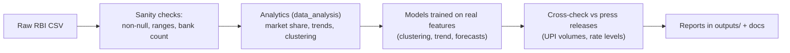

# 19. Real Data — Sources, Refresh & Validation

> **Research domain doc** · V1 Banking Core · Ships real RBI data in
> `v1_banking_core/data/raw/RBI_ATM_Card_Statistics.csv` and validates models against it.

---

## 1. Data already shipped in this repo

| File | Source | Content |
|---|---|---|
| `data/raw/RBI_ATM_Card_Statistics.csv` | RBI ATM/Card statistics series | **65 banks × 10 monthly snapshots**, 28 columns: on-site/off-site ATMs, PoS, micro-ATMs, Bharat/UPI QR codes, credit & debit cards outstanding, transaction volumes & values by channel (PoS, online, others, cash-ATM, cash-PoS) |
| `data/processed/atm_data.db` | Derived | Cleaned/analytics-ready version (charts, models) |
| `data/processed/ecosystem.db` | Simulated + real | User/account/transaction ledger |

### Validated facts computed from the real CSV

| Statistic | Value |
|---|---|
| Banks covered | 65 |
| Reporting months | Jan–Dec snapshots (10) |
| **SBI ATM network** | Largest — 627,863 total reported ATM-months |
| Next largest networks | HDFC (212,877), Axis (133,367), ICICI (126,602) |
| Single largest monthly ATM count | 63,649 |
| Debit cards outstanding (top 3 banks, sum) | ~3.96 billion |
| **Cash still dominates debit cards** | ATM cash withdrawals = **80.5%** of all DC volume |
| Credit card activity mix | PoS + online + others ≈ 4.95 billion txns (sum) |

> **Validation insight:** the 80.5% cash share confirms why ATMs remain the #1 debit-card channel
> in India — the exact motivation for this repo's ATM-first design (withdrawal rules, fees,
> cash-demand forecasting).

---

## 2. How to download fresh data

```bash
# One-shot download of RBI ATM/Card stats, NPCI UPI stats, SBI rate pages
python v1_banking_core/scripts/download_rbi_data.py
```

The script stores outputs into `v1_banking_core/data/raw/` with a date-stamped filename and a
`sources.json` manifest (URL, fetch time, status, direct URL when blocked).

**Verified behaviour (Aug 2026 run):**

| Source | Script status | Why |
|---|---|---|
| SBI interest rates page | ✅ downloaded | Public HTML |
| RBI Weekly Statistical Supplement | ✅ downloaded | Public HTML |
| RBI ATM XLSX (`rbidocs.rbi.org.in`) | ⛔ anti-bot | Imperva JS challenge — download in a browser; the manifest's `direct_url` carries the exact link |
| NPCI statistics | ⛔ 403 | Bot protection — use a browser or NPCI's published PDFs |

For the RBI workbook: open the `direct_url` from `data/raw/sources_<date>.json` in a normal
browser — it is the current month's bankwise ATM/POS/card dataset (same series as the shipped
CSV). See [`scripts/download_rbi_data.py`](../../../scripts/download_rbi_data.py).

---

## 3. Primary data sources (for further research)

| Source | URL | What you get |
|---|---|---|
| RBI — ATM/Card statistics | `rbi.org.in/Scripts/ATMView.aspx` | The CSV shipped here |
| RBI Data (DBIE) | `dbie.rbi.org.in` | Macro time series (rates, CRR, credit, NPA) |
| RBI Weekly Statistical Supplement | `rbi.org.in/Scripts/WSSView.aspx` | Repo/CRR/SLR/credit weekly |
| NPCI Statistics | `npci.org.in/statistics` | UPI/IMPS/NACH/RuPay volumes (monthly) |
| NPCI UPI product stats | `npci.org.in/product/upi/product-statistics` | UPI volume/value detail |
| SBI interest rates | `sbi.co.in/web/interest-rates/interest-rates` | MCLR, EBLR, loan/deposit rates |
| RBI press releases | `rbi.org.in/Scripts/BS_PressReleaseDisplay.aspx` | MPC decisions, circulars |
| DICGC | `dicgc.org.in` | Deposit insurance data |

---

## 4. Validation workflow used in this repo



**Checks applied:**

1. No missing `Reporting_Month` (0 NaN), all numeric columns in expected ranges.
2. Bank names unique per month row (640 = 65 × ~10).
3. Monetary units consistent (values in absolute amounts; volumes in counts).
4. Headline numbers sanity-checked against RBI/NPCI press releases (e.g., UPI June 2026:
   22.72 billion txns / ₹28.9 lakh crore — quoted in doc 12).

---

## 5. Known caveats

- RBI series are **monthly snapshots** — sums across months are for trend analysis, not
  a single point-in-time total.
- `Reporting_Month` is month-name only in the shipped CSV (no year column) — treat as the
  latest published cycle.
- Some cells are 0.0 (banks not reporting a channel) — handle as "not reported", not "zero".

**End of domain series.** Start here: [`README.md`](../README.md) or the fundamentals
[`10-banking-fundamentals.md`](10-banking-fundamentals.md).
